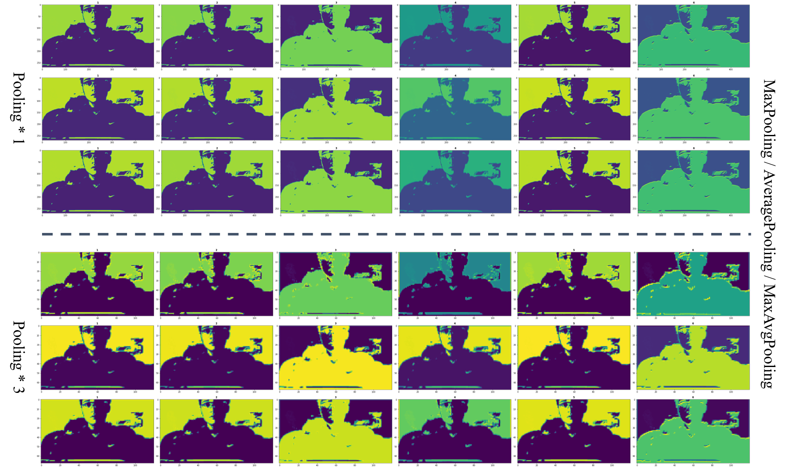
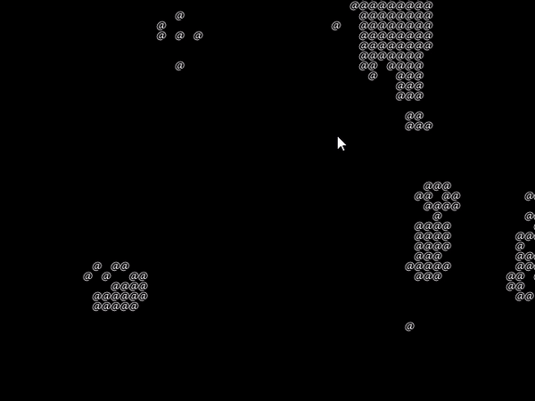

# Our Artwork

ARENA, Art & Technology, CAU.

## 00 Extract Feature Map

Content : Extract Feature Map in Image Data for Object Detection.
 Creator : [Bumsoo Kim](https://github.com/gh-BumsooKim)
 Code : [Python Code](00-Extract-Feature-Map/00-Extract-Feature-Map.ipynb)

Settings : `import tensorflow` for Convolution, Pooling Layer.

Reference : [What is Feature Map](https://towardsdatascience.com/applied-deep-learning-part-4-convolutional-neural-networks-584bc134c1e2)

## 01 Hand Magic with @

Content : I'm Hand Magician.
 Creator : [Bumsoo Kim](https://github.com/gh-BumsooKim)
 Code : Processing Code, Not yet OpenSource.
