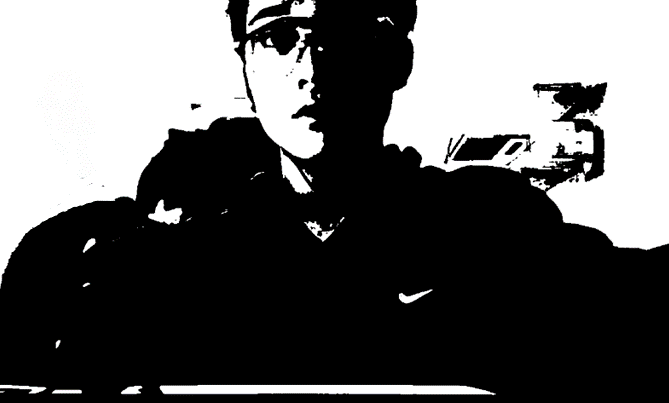

# Our Artwork

ARENA, Art & Technology, CAU.

## 00 Image ThresHolding

Content : thresholding is the simplest method of segmenting images.
 Creator : [Bumsoo Kim](https://github.com/gh-BumsooKim)
 Code : [Processing Code](00-Image-ThresHolding/ThresHolding.pde)

Settings : `import processing.video.*;` for Webcam

Reference : [What is Thresholding](https://en.wikipedia.org/wiki/Thresholding_(image_processing))

## 01 
